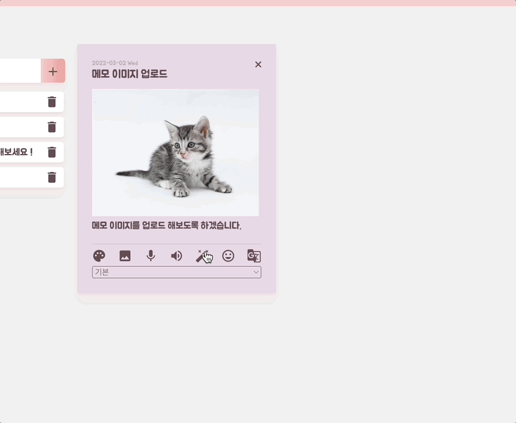

# 🐥 Opensource-Project-Note-App

<h1><b>2020 오픈소스프로젝트 - Knock Note</b></h1>

https://osp20-25073.web.app

</a>
</a>
</a>
</a>
</a>

-   기간
    -   (ver.1) 2020년 10월 ~ 2020년 12월
    -   (ver.2) 2022년 2월 말 ~ 3월 초
-   개요
    -   주어진 Vue.js 코드를 기반으로 각자의 기능과 디자인을 창조하여 메모 앱 제작
    -   메모 CRUD가 가능해야하며, Tensorflow.js 기능을 접목시켜야함.
-   기능
    -   메모 생성/수정/삭제
    -   메모 카테고리 필터링, 카테고리 추가/삭제
    -   메모 테마 변경
    -   메모 이미지 업로드
    -   메모 검색 필터링
    -   음성인식을 이용한 메모 작성
    -   음성으로 메모 내용 읽기
    -   Tensorflow.js 를 이용한 이미지 객체 탐지
    -   Naver CFR API 를 이용한 이미지 휴먼 객체 감정 인식
    -   Naver Papago API 를 이용한 메모 내용 번역
    -   To Do List 생성/완료/삭제
    -   상단으로 이동하기
    -   반응형 웹 페이지
    -   Firebase 인증/데이터베이스/스토리지 사용

 
 

<h2>🛠 기능 소개</h2>

### [메모 생성]
- 헤더에 있는 생성 버튼을 클릭하여 메모를 생성할 수 있습니다.
- 메모를 생성할 때는 제목/내용/카테고리/테마 를 변경할 수 있습니다.
 
 

### [메모 수정]
- 생성된 메모를 클릭하여 제목과 내용을 수정할 수 있습니다.
 
 

### [메모 삭제]
- 메모 상단에 위치한 [x] 버튼을 클릭하여 메모를 삭제할 수 있습니다.

 
 

### [메모 이미지 업로드]
- 메모 하단의 이미지 버튼을 클릭하여 메모의 이미지를 업로드할 수 있습니다.
- 다시 버튼을 눌러 다른 이미지로 업로드할 수 있습니다.

 
 

### [메모 음성 인식]
- 메모 하단의 마이크 버튼을 클릭하여 음성을 인식하여 메모를 작성할 수 있습니다.
- 음성 인식을 할 시 알람창이 뜹니다.

 
 

### [메모 음성 읽기]
- 메모 하단의 스피커 버튼을 클릭하여 메모의 본문을 읽을 수 있습니다.

 
 

### [메모 테마 변경]
- 메모 하단의 팔레트 버튼을 클릭하여 메모의 테마를 변경할 수 있습니다.
- 총 5가지의 색이 있습니다.

 
 

### [메모 이미지 객체 탐지]
- Tensorflow.js 모듈을 사용합니다.
- 메모 하단의 버튼을 클릭하여 해당 이미지의 객체를 인식할 수 있습니다.
- 모달창으로 객체 내용을 확인할 수 있습니다.
- 객체를 인식하지 못하면 😢 이모지가 뜹니다.

 
 

### [메모 카테고리 필터링]
- 화면 상단에 위치해있는 카테고리를 이용하여 메모 필터링이 가능합니다.
- 메모 하단에서 카테고리를 설정할 수 있습니다.
- 필터링을 하면 설정한 카테고리의 메모만 화면에 나타납니다.

 
 

### [메모 카테고리 추가]
- 화면 상단의 카테고리 옆 아이콘을 클릭하여 카테고리를 추가할 수 있습니다.
- 카테고리를 관리하는 모달창이 뜹니다.

 
 

### [메모 카테고리 삭제]
- 카테고리 모달창에서 카테고리를 삭제할 수 있습니다.
- 해당 카테고리로 설정된 메모는 카테고리가 없어집니다.

 
 

### [메모 검색]
- 화면 상단 좌측의 검색창에서 메모를 검색할 수 있습니다.
- 해당 검색 키워드를 가진 메모만 필터링되어 화면에 나옵니다.

 
 

### [메모 검색 & 카테고리 필터링]
- 해당 카테고리 내에서 검색 키워드를 이용하여 메모를 검색할 수 있습니다.
- 검색 키워드 내에서 해당 카테고리의 메모를 찾는 것도 가능합니다.

 
 

### [To Do List]
- 화면 좌측에 존재하는 ToDoList 기능으로 할 일을 작성할 수 있습니다.
- 할 일을 체크하고, 삭제도 가능합니다.

 
 

### [반응형 웹]
- 반응형 웹 사이트입니다.
